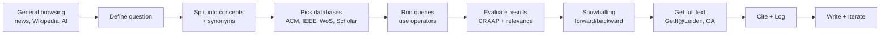

# (Re)Searching the Literature

Class: Studying and Presenting
Last edited time: September 22, 2025 1:36 PM
Synopsis: This resource provides comprehensive guidance for conducting literature searches, including using library tools, evaluating sources, and employing effective search strategies. Key topics include understanding different types of literature, utilizing the CRAAP test for source evaluation, and leveraging AI tools for research. It emphasizes the importance of documenting searches, citing sources correctly, and maintaining academic integrity throughout the research process.

# **(Re)Searching the Literature**

**Course context:** Studying & Presenting • Leiden University

**Lecturer:** Rutger de Jong (Subject Librarian, Science)

**Purpose of this document:** Full coverage of every slide with expanded explanations, examples, quick checks, visuals, and end‑of‑section takeaways. This file will evolve with future clarifications.

---

## Quick summary:

---

### **1. Source Types and Reliability**

- **Scientific literature**
    - Written by scholars, peer-reviewed, evidence-based.
    - Includes journal articles, systematic reviews, academic books.
    - Primary currency in academia, especially for theses and exams.
- **Grey literature**
    - Reports, theses, working papers, technical notes, datasets.
    - Often produced by organizations or researchers outside formal publishing.
    - Reliability varies; use with caution and usually only to supplement.
- **Popular literature**
    - News, blogs, magazines, websites.
    - Simplified, aimed at general audiences.
    - Useful for inspiration and context, but not for academic argumentation.
- **Peer review**
    - Process of experts evaluating manuscripts.
    - Improves reliability but still fallible.
    - Must still apply critical evaluation (CRAAP test).

---

### **2. Evaluating Sources — CRAAP Test**

- **Currency**: Is the publication recent enough?
- **Relevance**: Does it address your specific question? Is it at the right level?
- **Authority**: Who is the author? Institution? Journal reputation?
- **Accuracy**: Are methods transparent, data verifiable, conclusions supported?
- **Purpose**: Is it neutral, commercial, or advocacy-driven?

---

### **3. AI in Literature Searching**

- **Benefits**:
    - Reformulate queries.
    - Summarize large texts.
    - Identify related concepts and keywords.
- **Risks**:
    - Generates false or non-existent references.
    - Blends plausible but unverifiable claims.
- **CLEAR framework** for effective prompts:
    - Concise, Logical, Explicit, Adaptive, Reflective.
- **Rule**: AI is a helper for searching and summarizing, never a substitute for reading and verifying original papers.

---

### **4. Search Strategy and Workflow**

1. **Initial Exploration**
    - Start with general tools (Google, Wikipedia, news articles) to collect terms.
    - Extract early references from popular press and trace back to scholarly work.
2. **Formulating a Research Question**
    - Use *Who, What, Where, When, Why, How*.
    - Example: “How does algorithmic bias in facial recognition influence robot decision-making?”
3. **Breaking into Concepts**
    - Identify key components of the question.
    - Generate synonyms and related terms.
    - Example: *bias* (algorithmic, gender, racial), *facial recognition* (computer vision, facial analysis), *robot* (autonomous system, drone).
4. **Constructing Search Queries**
    - Boolean logic:
        - OR = synonyms.
        - AND = different concepts.
        - NOT = exclude terms.
    - Wildcards: * (multiple characters), ? (single character).
    - Quotation marks for exact phrases.
5. **Databases and Tools**
    - Leiden Catalogue (gateway to licensed content).
    - ACM Digital Library, IEEE Xplore, Web of Science, Scopus.
    - Semantic Scholar, Lens.org, Google Scholar (broad but noisy).
    - ArXiv for preprints (check if later peer-reviewed).
6. **Snowball Searching**
    - Backward: follow references cited in the paper.
    - Forward: see who cited the paper (using Google Scholar, Web of Science, Lens).
    - Helps locate seminal works and track field evolution.
7. **Search Logging**
    - Record database, query string, filters, and number of results.
    - Note relevance and next steps.
    - Ensures reproducibility and avoids redundant searching.

---

### **5. Accessing Literature**

- **Primary route**: GetIt@Leiden links in databases.
- **Alternatives**: Leiden Catalogue, Google Scholar (with “Leiden University” library links enabled), author websites, contacting authors directly.
- **Interlibrary Loan**: fallback for unavailable content.
- **Library plugin**: enables seamless off-campus access to licensed databases.

---

### **6. Referencing and Plagiarism**

- **Reference management**
    - Use Zotero or similar.
    - Export citations (BibTeX, RIS) from databases.
    - Always verify imported metadata (title, authors, DOI, year).
- **Citation principles**
    - Every claim or idea that is not your own must be cited.
    - Paraphrasing = restructure in your own words *after* understanding.
    - Copying structure or wording, even with slight changes, counts as plagiarism.
- **Why cite**: Academic traceability, crediting authors, and avoiding misconduct.

---

### **7. Reading Scientific Articles**

- **Standard structure**:
    - Title & Abstract: identify scope and result.
    - Introduction: problem, motivation, contribution.
    - Related Work: positioning in the field.
    - Methods: procedure, reproducibility.
    - Results: findings.
    - Discussion: meaning, limitations, implications.
    - Conclusion: summary, future directions.
    - References: traceability.
- **Efficient reading strategy**:
    1. Skim title, abstract, figures, conclusion.
    2. Read introduction and methods.
    3. Examine results and discussion.
    4. Decide whether to keep, cite, or discard.
- **Altmetrics**: Show attention (news, blogs, policy) but not scientific quality.

---

### **8. Search Troubleshooting**

- **Too few results**:
    - Test each concept separately.
    - Add synonyms or broader terms.
    - Try different databases.
- **Too many results**:
    - Add more specific concepts.
    - Apply filters (year, subject, type).
    - Check for Boolean errors (AND/OR misused).

---

### **9. Final Workflow (Iterative Cycle)**

1. Identify topic → brainstorm terms.
2. General exploration → collect vocabulary.
3. Formulate precise research question.
4. Break into concepts and synonyms.
5. Construct Boolean queries.
6. Search multiple databases.
7. Evaluate results (CRAAP test).
8. Expand through snowballing.
9. Retrieve full texts legally.
10. Record everything in a search log.
11. Manage citations in a reference manager.
12. Paraphrase properly and cite.
13. Read strategically.
14. Refine and repeat as needed.

---

---

## **Slide 1 — Feedback Fruits**

**What:** Orientation to the course interaction tool and Brightspace navigation.

**Why it matters:** You’ll access slides, videos, and in‑lecture questions here.

**Action:** Ensure access to Brightspace → Studying and Presenting; open the (Re)Searching the Literature presentation.

**Key takeaways**

- Know where the material lives and how to refresh if the session drops.

---

## **Slide 2 — (Re)Searching the Literature**

**What:** Session goals led by the subject librarian for Science.

**Why:** Sets scope: reliable sources, search strategy, evaluation, citation, and reading.

**Key takeaways**

- Treat today’s workflow as your default research pipeline.

---

## **Slide 3 — Our libraries**

**What:** Leiden University Libraries: 7 locations + 2 offices abroad; >60k e‑journals; >600 databases; >13M (e‑)books. Facilities include printers, silent and collaboration spaces.

**Why:** Access breadth and on‑campus study resources.

**Key takeaways**

- Use the library catalogue as a gateway to paid databases.

---

## **Slide 4 — Feedback Fruits: what will you learn here**

**What:** You will respond to in‑class prompts to check understanding.

**Why:** Active engagement improves retention.

**Key takeaways**

- Treat prompts as mini‑checks for concepts.

---

## **Slide 5 — Programme Overview**

**Topics:**

- Evaluate information quality and “what counts” as scholarly.
- Operate scholarly databases.
- Rephrase questions for database logic.
- Use information ethically: find full‑text, cite, avoid plagiarism.
- Read articles effectively over time.

**Key takeaways**

- The course covers the full research cycle: **find → evaluate → use → cite**.

---

## **Slide 6 — What is scientific literature?**

**Types and traits**

- **Scientific:** Scholar‑authored, research‑based, objective tone, peer‑reviewed. Includes journal articles, reviews, academic books.
- **Grey literature:** Not traditionally published; varying reliability; for experts. Includes reports, theses, datasets, working papers, some websites.
- **Popular:** For general audiences; simplified; connects to societal issues. Includes newspapers, magazines, general websites.

**Why:** Recognize source tiers and when each is appropriate.

**Key takeaways**

- Match source type to task. Exams and theses rely primarily on scientific literature; grey/popular can give context.

---

## **Slide 7 — Peer review for reliability**

**Point:** Peer review is a quality control step. Example: goats preferring positive human emotional expressions (Royal Society Open Science).

**Key takeaways**

- Peer review ≠ infallible, but it raises reliability.

---

## **Slide 8 — Staying up to date: arXiv**

**What:** Preprints and postprints.

**Why:** Track cutting‑edge work before journal publication; locate free versions.

**Key takeaways**

- Always check whether a preprint later appeared in a peer‑reviewed venue.

---

## **Slide 9 — When to use what source?**

- **Statistical info:** Governments, organizations, datasets.
- **Scientific info:** Journals, reviews for state‑of‑the‑art, academic books for breadth/historical context, conferences (especially CS/Engineering).

**Key takeaways**

- Reviews = fast on‑ramp. Conferences = bleeding edge in CS.

---

## **Slide 10 — CRAAP Test**

**Checklist:**

- **Currency:** Is it recent enough for the field?
- **Relevance:** Fit to your question and level?
- **Authority:** Credible author/venue?
- **Accuracy:** Methods and data verifiable? Peer‑reviewed?
- **Purpose:** Neutral vs sponsored/advocacy?

**Mnemonic:** **C‑R‑A‑A‑P**.

**Key takeaways**

- Use CRAAP to filter out sources before deep reading.

---

## **Slide 11 — What about AI search?**

**Risks:** unverifiable claims, hallucinated references, probability over proof.

**Upsides:** query reformulation, concept discovery, summaries.

**Best practice:**

- Use specialized tools (Elicit, Semantic Scholar, Perplexity) to **find** literature.
- **Verify** everything by opening and reading the sources.

**Key takeaways**

- AI assists search. It never substitutes reading the paper.

---

## **Slide 12 — AI or human?**

**Giveaways of low‑quality text:** plausible but unreferenced, hollow rephrasing, excessive repetition, uncritical positivity.

**Legitimate uses:** overview reading, brainstorming queries, asking questions about a text you have.

**Academic integrity:** Copy‑paste without understanding = fraud.

**Key takeaways**

- Keep a verification mindset. Paraphrase only after comprehension.

---

## **Slide 13 — CLEAR Framework for better prompts**

- **Concise:** No fluff. Example: “Explain photosynthesis and its significance.”
- **Logical:** Structured output request.
- **Explicit:** Specify format and scope.
- **Adaptive:** Iterate when results are generic.
- **Reflective:** Evaluate accuracy and completeness.

**Key takeaways**

- Good prompts → better search assistance and summaries.

---

## **Slide 14 — Finding inspiration**

**Idea:** Start broad. Read news, blogs, and encyclopedic overviews to surface keywords and controversies.

**Key takeaways**

- Inspiration sources are inputs to your controlled scholarly search, not outputs to cite.

---

## **Slide 15 — Starting your search**

**Step 1:** General search in Google or an AI tool to harvest keywords. Follow news sites and Wikipedia for overview terms.

**Example topic:** Algorithmic bias in facial recognition and robot behavior.

**Key takeaways**

- Your first goal is a **vocabulary** that maps to scholarly terms.

---

## **Slide 16 — First reference**

**Trace a claim** in a popular article to the scholarly source.

**Example:** Wired article → FAccT 2022 paper “Robots Enact Malignant Stereotypes.”

**Key takeaways**

- Always locate the primary scholarly source behind media coverage.

---

## **Slide 17 — From general to scholarly searching**

**Transition:** Use the harvested keywords to search scholarly databases.

**Key takeaways**

- Switch from broad discovery to precise retrieval.

---

## **Slide 18 — Where to find scientific information?**

- Journals vs conference proceedings; you need multiple sources.
- Tools with AI affordances: **Semantic Scholar**, **Lens.org**.

**Key takeaways**

- Each database has quirks. Learn filters, fields, and operators.

---

## **Slide 19 — Catalogue: the central source**

**Use:** https://catalogue.leidenuniv.nl as a discovery engine for articles, books, and databases.

**Tip:** Install the library plugin for off‑campus access.

**Key takeaways**

- Catalogue = gateway to ACM, IEEE Xplore, Web of Science, etc.

---

## **Slide 20 — Catalogue overview**

**Action:** Practice basic and advanced searches. Use facets, subject headings, and date filters.

**Key takeaways**

- Combine subject headings with keywords for precision + recall.

---

## **Slide 21 — The Seminal Paper**

**How to find:**

- Use citation indices (Lens, Semantic Scholar, Web of Science, Google Scholar).
- Search topic histories and reviews; look for “landmark,” “seminal,” or foundational works.

**Traits:** early, highly cited, reframes the field, poses core problem without full solution.

**Key takeaways**

- Seminal papers are anchors for your literature map.

---

## **Slide 22 — [Intentional placeholder]**

If the slide was visual or transitional, the concept is covered in adjacent sections.

**Key takeaways**

- Focus remains: map the field and trace influence via citations.

---

## **Slide 23 — Snowball Searching**

**Backward:** Check references in a paper (older work; find antecedents and seminal papers).

**Forward:** Check who cites the paper (newer developments).

**Caution:** Citation counts reflect popularity, not quality.

**Key takeaways**

- Use snowballing both ways to expand coverage quickly.

---

## **Slide 24 — Example using ACM Digital Library**

**Skill:** Use ACM DL fields (title/abstract/keywords), controlled vocabulary, and author pages. Save searches and set alerts.

**Key takeaways**

- Master one database deeply; the skills transfer to others.

---

## **Slide 25 — Targeting with keywords**

**Workflow:**

1. Extract core concepts.
2. Brainstorm synonyms and related terms.
3. Use quotes for multi‑word phrases.
4. Group synonyms with OR; combine concepts with AND.

**Key takeaways**

- Precision comes from structure: (concept1 OR synonyms) AND (concept2 OR synonyms) …

---

## **Slide 26 — Searching with Google Scholar**

**Pros:** massive coverage, full‑text matching, citation graph, OA links.

**Cons:** noisy results, fake journals, older items rank high by “relevance,” limited filters.

**Tips:**

- Log in → Settings → Library Links → add “Leiden Universiteit”.
- Do not sort by year unless exploring recency; prefer filters.

**Key takeaways**

- Scholar is a quick scout, not your only database.

---

## **Slide 27 — Define your research question**

**Use 5W/1H:** what, who, how, where, when, why.

**Example:** How does algorithmic bias in facial recognition influence robot actions?

**Key takeaways**

- A clear question shapes your concepts and operators.

---

## **Slide 28 — Divide the question into concepts**

**Example decomposition:**

- C1: “algorithmic bias” OR “race bias” OR “gender bias”
- C2: “facial recognition” OR “facial analysis” OR “computer vision”
- C3: robot OR drone OR “autonomous system”

**Key takeaways**

- Build synonym sets before you search. Use plural variants.

---

## **Slide 29 — Booleans and wildcards (* ?)**

- **OR** within synonyms; **AND** across concepts; **NOT** to exclude.
- Wildcards depend on database:
    - zero or more characters (e.g., protest* → protest, protests, protester).
    - ? single unknown character (e.g., pal? → pale, pals).
- Be aware of stemming rules per database.

**Key takeaways**

- Always check the database help page for operator differences.

---

## **Slide 30 — How many results in IEEE Xplore?**

**Prompted task:** Use synonym sets for **algorithm bias/gender bias/race bias** AND **robot/drone**.

**Tips:** Quote multi‑word phrases. Consider plurals with wildcards.

**Key takeaways**

- Iterate queries. Adjust concepts with too many or too few hits.

---

## **Slide 31 — Searching verifiability**

**Maintain a Search Log** to make your process auditable.

**Search Log Template**

- Query string:
- Database:
- Date/time:
- Filters:
- Top relevant results (IDs/DOIs):
- Notes: What worked? What to change next?

**Key takeaways**

- A log prevents circular searching and supports your methods section.

---

## **Slide 32 — How to get the article**

**Steps:**

1. Use **GetIt@Leiden** from databases.
2. If unavailable: check **Catalogue**; try **Google Scholar** for OA versions; contact the author; as last resort use **Interlibrary Loan**.
3. Install the library access plugin for paywalled content.

**Key takeaways**

- Never stop at a paywall. There’s usually a legal route to access.

---

## **Slide 33 — References (citations)**

**Sources give citation metadata.** Export BibTeX for LaTeX. Verify title, authors, venue, year, pages, DOI.

**Key takeaways**

- Use a reference manager (e.g., Zotero). Clean imports before writing.

---

## **Slide 34 — Why refer**

**Reasons:** traceability, credit, and avoiding plagiarism.

**Method:** cite and paraphrase properly.

**Key takeaways**

- Every non‑trivial claim needs a source or a derivation.

---

## **Slide 35 — Citing**

**Practice:** Export citations from databases; standardize style; ensure completeness.

**Tooling:** Zotero + Better BibTeX; LaTeX/BibLaTeX; Word with CSL styles.

**Key takeaways**

- Consistent metadata now saves hours at submission.

---

## **Slide 36 — Is this plagiarism?**

**Example:** A paraphrase closely tracks original wording/structure.

**Rule:** Paraphrase after full comprehension and with your own structure. Always cite the source of the idea.

**Canonical case:** Buolamwini & Gebru (2018) on demographic accuracy disparities.

**Key takeaways**

- Paraphrase ideas, not sentences. Keep citations.

---

## **Slide 37 — Tip: learn to read the literature**

**Altmetrics:** Track how research diffuses: news, blogs, policy, Wikipedia, social media.

**Use:** In reference managers and at publisher pages (PlumX, Altmetric badges).

**Key takeaways**

- Altmetrics show attention, not necessarily quality. Use alongside peer review and citations.

---

## **Slide 38 — Summary**

**Pipeline:**

1. Think before you search.
2. Do a general search.
3. Formulate a question.
4. Split into concepts.
5. Pick the right databases.
6. Evaluate and iterate.
7. Cite and log everything.

**Key takeaways**

- Research is iterative. Document as you go.

---

## **Slide 39 — Contacts**

**Subject librarian:** Rutger de Jong • r.m.de.jong@library.leidenuniv.nl

**Key takeaways**

- Ask for database‑specific help when stuck.

---

## **Slide 40 — Anatomy of an article**

**Typical structure:**

- **Title/Abstract:** scope and main result.
- **Introduction:** problem, gap, contributions.
- **Related work:** positioning.
- **Methods:** how the study was done; reproducibility.
- **Results:** findings without interpretation.
- **Discussion:** meaning, limitations.
- **Conclusion:** takeaway and future work.
- **References:** traceability.

**Reading strategy:**

1. Skim title → abstract → figures → conclusion.
2. Read intro and methods.
3. Evaluate results and limitations.
4. Decide whether to file as background, core evidence, or discard.

**Key takeaways**

- Read strategically. Not all papers deserve full‑depth reading.

---

## **Slide 41 — Number of results: Too few / Too many**

**If too few:**

- Test concepts separately; fix the narrowest one.
- Check spelling. Add synonyms. Broaden a concept. Change database. Use reference lists and author pages.

**If too many:**

- Check parentheses. Swap OR/AND errors. Add a concept. Apply filters (year, venue, subject).

**Key takeaways**

- Diagnose by isolating concepts. Tune breadth with operators and filters.

---

## **Visual aids**

### **Boolean logic patterns**

```
(
  "algorithmic bias" OR "gender bias" OR "race bias"
) AND (
  "facial recognition" OR "facial analysis" OR "computer vision"
) AND (
  robot OR drone OR "autonomous system"
)
```

### **Research workflow (Mermaid)**



### **CRAAP Checklist Table**

| **Criterion** | **Questions** | **Action** |
| --- | --- | --- |
| Currency | Publication year suitable? | Apply year filters |
| Relevance | Directly answers your question? Level matched? | Read abstract; exclude off‑topic |
| Authority | Reputable venue, qualified authors? | Check affiliations, h‑index cautiously |
| Accuracy | Methods transparent? Data available? | Prefer peer‑reviewed; verify claims |
| Purpose | Neutral intent? Disclosures? | Note funding, conflicts |

---

## **Quick practice set**

1. Build a three‑concept query for your current topic. Produce one broad and one narrow version.
2. Log a search in two databases. Compare hit quality and noise.
3. Trace a popular article to its scholarly source. Verify the claim.

---

## **Appendix — Reusable templates**

### **A. Search Log (copy block)**

```
Topic:
Research question:
Date/time:
Database:
Query string:
Filters:
Top results (IDs/DOIs):
Notes (relevance, gaps, next step):
```

### **B. Reading Notes (per paper)**

```
Citation (clean):
Problem/gap:
Methods:
Key results:
Limitations:
How I will use it:
Quotable definitions (with page):
Follow‑ups (forward/backward snowballing):
```

### **C. Paraphrase protocol**

1. Read a section fully.
2. Close the text.
3. Write the idea in your own structure.
4. Reopen the text and check accuracy.
5. Add citation.

---